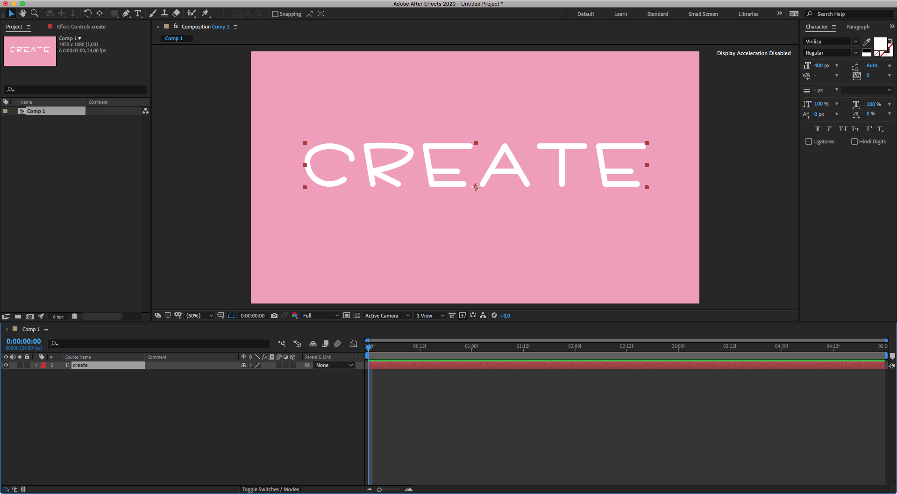
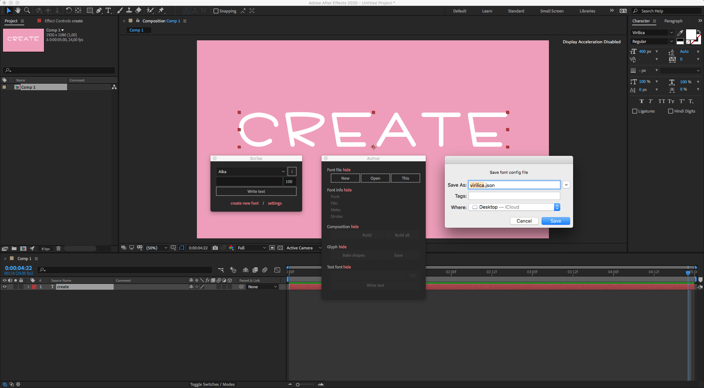
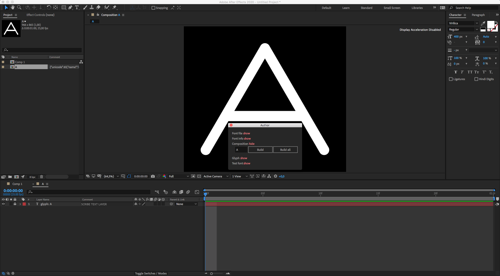
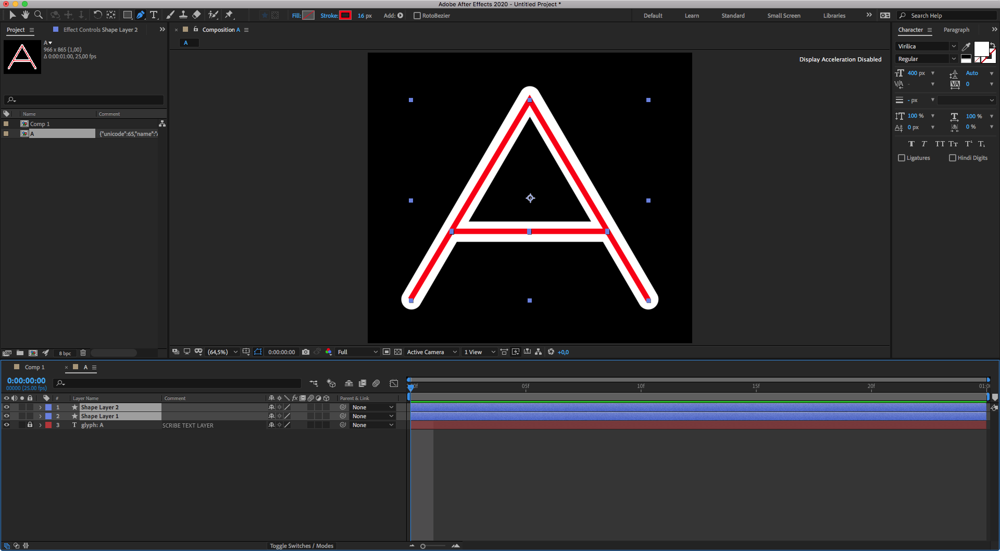
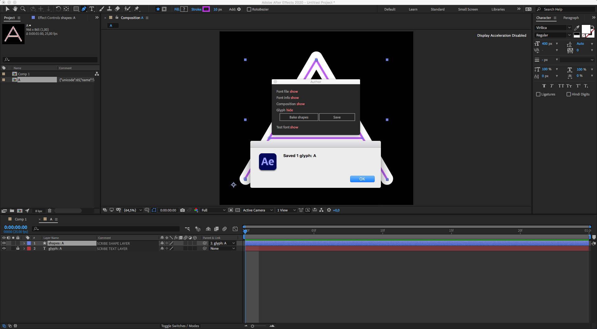
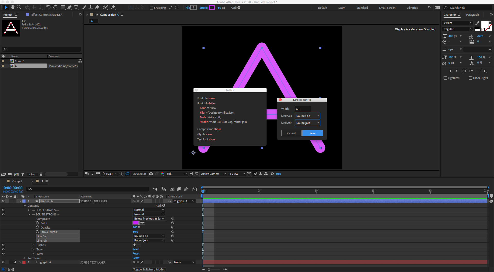
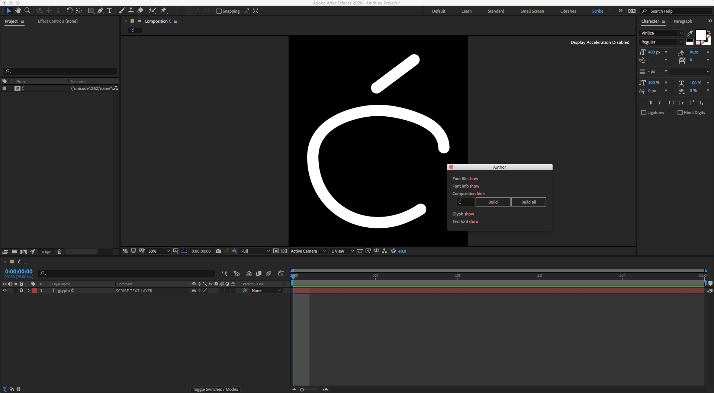
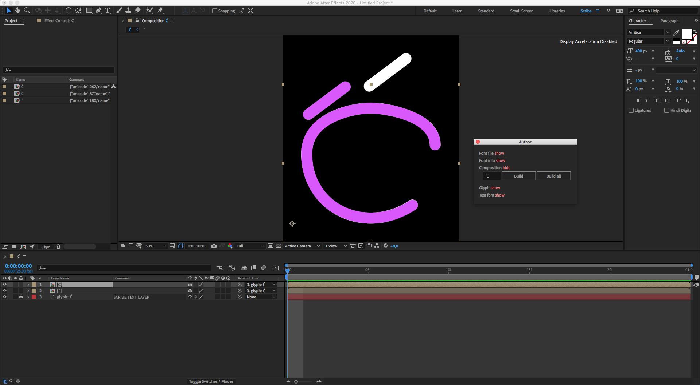
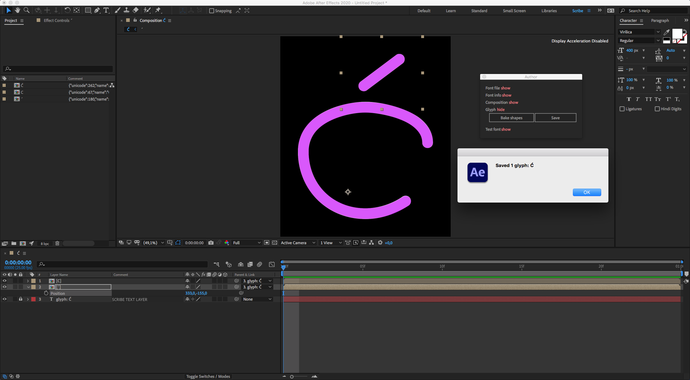

# Create font

This section describes how to create a simple yet beautiful geometrical Scribe font based on the [Virilica](https://fontesk.com/virilica-font/) font (designed by [Vesco Radic](https://github.com/VeskoRadic)).

> A note in advance - this is a tedious and time-consuming process, that involves a lot of manual labor to re-trace the shapes. Unfortunately, there is no automated way to make it faster.

---

## Using shapes

1. Make sure you have a static font (TTF or OTF) installed on your system.
2. Launch After Effects and create a new composition.
3. Inside that composition add a new Text Layer and set its font family to Virilica.
4. Write any text in that Text Layer. The text you write does not matter. What matters is the font family of the text.

5. In the Scribe [main interface](interface/main.md) click on the **create new font** button. A new [Author](interface/author.md) window will open up.
6. In the [Author](interface/author.md) window click on the **New** button under the [Font file](interface/author.md#font-file) section.
7. A new window will pop up asking to save a `virilica.json` file. Save it in the location you can find later.

8. In the **Input Text** field under the [Composition](interface/author.md#composition) section enter characters you wish you retrace. Let's enter **A** for now and click on **Build** button.

Script created a new composition with the name **A** and opened it in the viewport. The composition contains a Text Layer with the name **glyph: A** and has a comment **SCRIBE TEXT LAYER**.

> Please do not change or delete comments on layers or items that the Scribe script creates.

And now the hard work begins.

9. Grab the **Pen Tool** in the After Effects interface and start tracing out the "legs" of a character. Place the first point at the bottom-left, second - at the top, and the third at the bottom-right. You should end up with one Shape Layer that has 3 points in the timeline.

Deselect everything in the composition to start tracing out the horizontal bar. Grab the **Pen Tool** in the AE interface once again and create two points for the bar - one on the left, and the second on the right.

The composition should contain 3 layers in total:

- Shape Layer for the horizontal bar,
- Shape Layer for the outer part of the character
- A Text Layer, that Scribe created in step 8.

> The order of shape layers is important because it establishes the order of animation.

10. Once all of the shapes for the character are re-traced, you must click on the **Bake shapes** button under the [Glyph](interface/author.md#glyph) section to create a single Shape Layer.

Once this is done, a new Shape Layer is created in the composition with the name **shapes: A** and all of the old shape layers got disabled. At this point, old shape layers can be deleted, as all of the shape glyph information is stored in the newly created shape layer.

11. Click the **Save** button under the [Glyph](interface/author.md#glyph) section to save the glyph into the JSON file.

At this point, character A is saved and is ready to be used in the Scribe script.

12. Time to modify the stroke width and line caps.

Twirl-down the Shape Layers properties to reveal the **Stroke** group. Inside that group change **Stroke Width**, **Line Cap**, and **Line Join** to your liking. It's best to set the stroke width as close as possible to the width of the character.

In my case, I have these values:

- Stroke width - 60
- Line Cap - Round Cap
- Line Join - Round join

In the [Author](interface/author.md) window click on the **Stroke** button under the [Font info](interface/author.md#font-info) section and enter values you established. Click OK.

> This step should be performed only once, as the Stroke settings are applied globally to all the characters in the font.

13. To test the animation of the character **A**, enter **AAAAA** in the **Input field** under the [Test font](interface/author.md#test-font) section and click **Write text**.

Drag-to-change the **end** slider under the Scribe effect to see the write-on animation. Read how to do this [here](how-to/animate.md)

To retrace more characters, repeat steps 8 through 11.

So far the animation looks like this:

We have an issue here, because the horizontal bar is animated first, and the legs are animated later. Lets fix this in the [How to modify font](how-to/modify.md) section.

---

## Using components

Components refer to the reusable elements. For instance, the **Ć** glyph (latin capital letter c with acute) contains 2 glyphs:

1. **C** (latin capital letter c)
2. **´** (acute)

Let's create a **Ć** glyph with components by reusing already existing elements in the font.

1. Create 2 separate characters **C** and **´** by following the [using shapes](how-to/create.md#create-shapes) tutorial.
2. In the **Input Text** field under the [Composition](interface/author.md#composition) section type in **Ć** character and click a **Build** button.

This should create a new composition with name **Ć** and one text layer with a name **glyph: Ć**

3. In the **Input Text** field under the [Composition](interface/author.md#composition) section type in 2 characters: **´C** and hold down the ALT key and click on the **Build** button.

The script should have added 2 compositions **´** and **C** into the composition, created in step #1.

At this point the order of components is correct - first, we have a **C** character, and then we have a **´**. Once animated, character **C** will be animated first, followed by the **´** character.

However, the position of the **´** character is incorrect. Let's fix it in the next step.

4. Select layer **´** in the composition and move it into place, so it covers the **´** character in the viewport. Once done, click on the **Save** button in the [Glyph](interface/author#glyph) section.

The creation of the character **Ć** is finished. Once animated, it should look like this:

