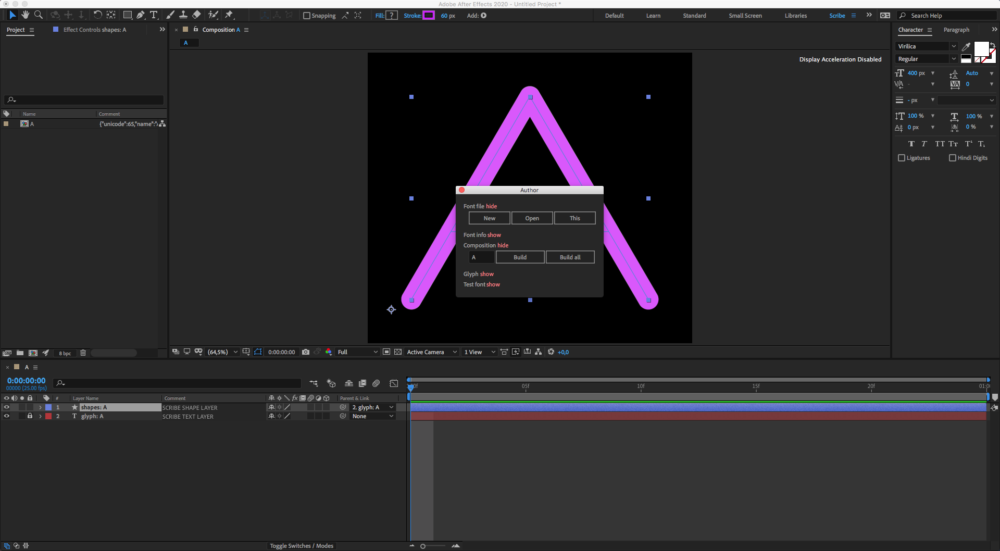
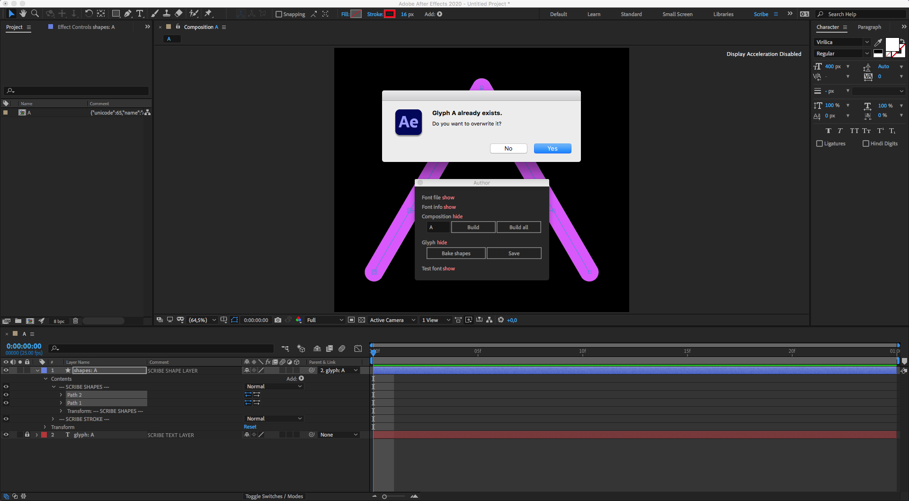

# Modify font

This section describes how to modify the existing Scribe font permanently.

Font modification includes:

- Reordering the animation
- Changing shapes
- Other

---

## Change the animation order

Unlike the [change the animation order](how-to/reorder.md) described previously, changing the order in the font is saved permanently and is persistent every time the user uses a specific character.

In the [How to create a font](how-to/create.md) section (step 9) we created a Viricila font with a character **A**. However, the animation of the horizontal bar and character legs is inversed - we should draw legs first, and then the horizontal bar. Let's fix it now.

1. Click on the **create new font** button in the [main interface](interface/main.md) to load the [Author](interface/author.md) window.
2. Click on the **Open** button in the [Font file](interface/author.md#font-file) section and select the `virilica.json` file.
3. In the **Input field** under the [Composition](interface/author.md#composition) section enter a character to modify. In this case it's a character **A**.
4. Click on a **Build** button.

At this point the script has created a composition with a name **A** that contains two layers:

- Shape Layer with name **shapes: A**
- Text Layer with name **glyph: A**

5. Twirl-down the shape layer to reveal shape groups **Path 1** and **Path 2**. In this instance "Path 1" is the horizontal bar and "Path 2" is the character legs.

6. Rearrange the order of groups so "Path 2" comes before the "Path 1" and click **Save** button. Click **Yes** to confirm.

Now, once animated, character **A** should animate like this:

