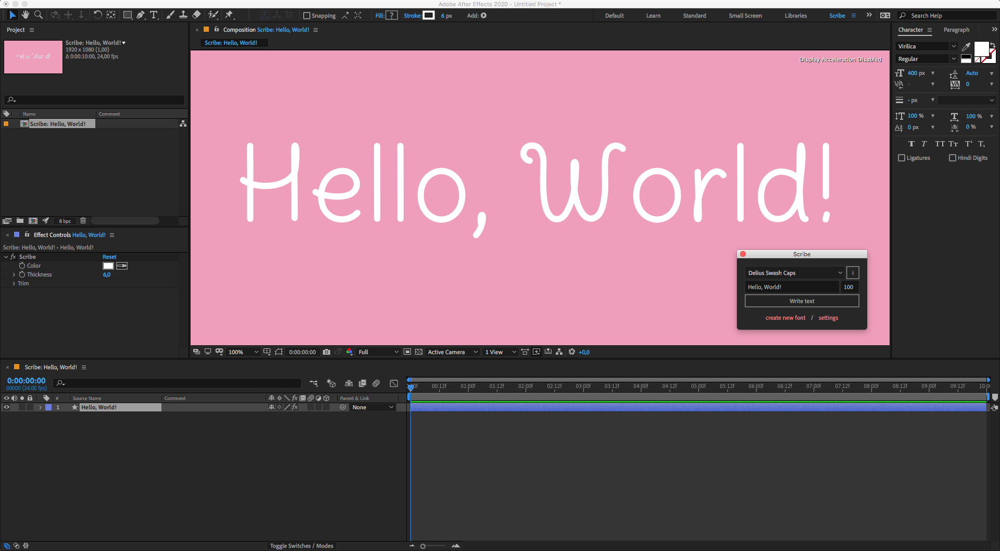

# Write

This section describes how to write the text "Hello, World!" with the "Delius Swash Caps" font at a font size of 100 pixels using Scribe.

---

1. Select a "Delius Swash Caps" font from the [font dropdown list](interface/main.md). Click on the **i** icon button to see the Font Info window, which contains a list of available glyphs as well as the font copyright information.
2. Write "Hello, World!" in the **Input field**.
3. Enter the **font size** value **100**.
4. If everything looks good, click on the **Write text** button.

> Don't panic if it takes some time to write the first text - the script is caching the font if it's the first time you use it after restarting the script.

At this point you should have:

- a new composition with the name "Scribe: Hello, World!",
- a shape layer with the name "Hello, World!",
- A pseudo effect with the name **Scribe** applied to a shape layer.

