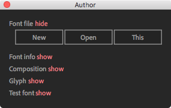
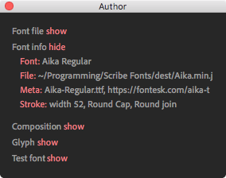
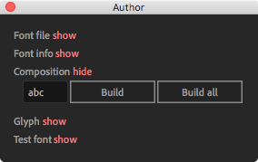
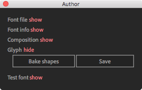
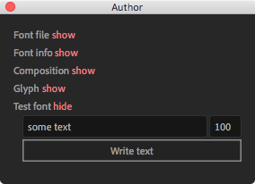

# Author window

See this page to create a new or modify an existing Scribe font.

---

## Font file

This section is dedicated to creating new or loading an existing animated font for the authoring.



- **New** button. Initializes a new animated font based on a selected Text Layer inside After Effects. You need to have a Text Layer selected for this option to work.

> This operation requires a [Node.js](https://nodejs.org/en/) module to be installed globally on your system.

- **Open** button. Prompts to open an existing animated font (_\*.json_ file)
- **This** button. Initialises the authoring for the currently selected font in the Scribes' [main interface](interface/main)

---

## Font info



- **Font** button. Shows the fonts' full name. It opens the Font Info window. once clicked. Corresponds to the **typeface** section in the JSON file:

```json
{
  "typeface": {
    "family": "Aika",
    "fullName": "Aika Regular",
    "postScriptName": "Aika-Regular",
    "style": "Regular",
    "unitsPerEm": 1000,
    "version": "1.0"
  }
}
```

- **File** button. Shows the path to the JSON file. Click to reveal a file in the finder.
- **Meta** button. Shows information about the static font file name and a downloadable link. Click to modify these values. Corresponds to the **meta** section in the JSON file.

```json
  "meta": {
    "fontFileName": "Aika-Regular.ttf",
    "fontDownloadURL": "https://fontesk.com/aika-typeface/"
  }
```

- **Stroke** button. Contains fonts Stroke configuration, such as Width, Line Cap, and Line Join options. Click to modify these values.

These options are applied to a **Scribe Pseudo Effect** when the user writes a text. Corresponds to the **stroke** section in the JSON file.

```json
{
  "stroke": {
    "lineCap": 2,
    "lineJoin": 2,
    "width": 52
  }
}
```

---

## Composition



- **Input text** field. Enter characters to crate glyph compositions for.
- **Build** button. Builds glyph compositions for each character in the _Input text_ field.
  - Hold _ALT_ to add glyphs as components into the currently active composition. If you want to animate the **Á** glyph (latin capital letter a with acute), you can first build **Á** glyph and then add **A** (latin capital letter a) and **´** (acute) as components.
- **Build all** button. Builds glyph compositions for each character in the font.
  - _CTRL_/_CMD_ builds animation-ready glyph compositions.
  - _ALT_ builds non-animation-ready glyph compositions.
  - _SHIFT_ opens each glyph composition in the viewport.

Once the composition is created, it should contain the following layers:

- Text Layer with one character.
- Shape Layer, if glyph contains traced-out shape data.
- Pre-comp layers, if glyph contains components data.
- Outlined Shape Layer, if **Create outlines** is enabled in the [Settings window](interface/settings.md#author)

---

## Glyph



- **Bake shapes** button. Bakes all shape layers into a master shape layer. You must use this option every time you trace out the glyph before saving it. The script will loop through all the enabled shape layers and collect the shape data and will create a new master Shape Layer, and apply that data. There should be only one (or none) master shape layer inside the glyph composition.

- **Save** button. Saves glyph. Saves shapes and components into the JSON file.

The following example shows JSON file content after saving the **Á** glyph (latin capital letter a with acute) that contains 2 components (**A** and **´**), where each component contains one shape layer:

```json
{
  "glyphs": [
    {
      "name": "A", // latin capital letter a
      "shapes": [
        { "closed": false, "inTangents": [], "outTangents": [], "vertices": [] }
      ],
      "unicode": 65
    },
    {
      "name": "acute", // acute
      "shapes": [
        { "closed": false, "inTangents": [], "outTangents": [], "vertices": [] }
      ],
      "unicode": 180
    },
    {
      "components": [
        { "offset": [], "unicode": 65 }, // latin capital letter a
        { "offset": [], "unicode": 180 } // acute
      ],
      "name": "Aacute", // latin capital letter a with acute
      "unicode": 193
    }
  ]
}
```

---

## Test font



Same functionality as the Scribes' [main interface](interface/main)
