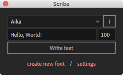

# Main window

Scribe compacts all of the necessary functions into a small interface.

1. **Font dropdown list**. Click and select a font you wish to use for the animation. If the list is empty, then you need to install fonts first. See [here](introduction/installation.md#fonts).
2. **Font info** button. Displays the information about the font, including its author and a list of available glyphs.
3. **Input text** field. A single-line text for the animation. You'll get a notification if the font does not contain characters from the text.
4. **Font size** field. Font size in pixels `0...10000`. This value directly correlates to the size of the static font.
5. **Write text** button. Writes the text inside After Effects.
6. **Create new font** buton. Opens an [Author](interface/author.md) window for font adaptation for the animation. See [here](how-to/create.md).
7. **Settings** buton. Opens the [Settings](interface/settings.md) window.
