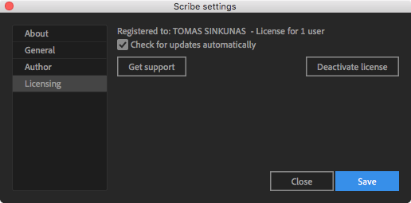

# Settings window

---

## General

- **Font library** field. The path to the folder, where Scribe fonts are located.
- **Install new fonts** button. Click to select and install new Scribe fonts.

---

## Author

These settings are applied when creating or modifying fonts via the [Author](interface/author.md) window.

- **Comp BG color** field. The composition background color in HEX.
- **Comp margins** field. The margins that are added around each glyph in the composition.
- **Font color** field. The text layer color in HEX.
- **Stroke color** field. The shape layer color in HEX.
- **Stroke opacity** field. The opacity of the shape layer.
- **Auto-create outlines** checkbox. When enabled, creates an outlined layer from the Text Layer. Similar to AEs' default `Create Shapes from Text` method, except it adds rectangles for shape vertices and tangents.

---

## Licensing

All information about the **aescripts+aeplugins** licensing lives here.

---
